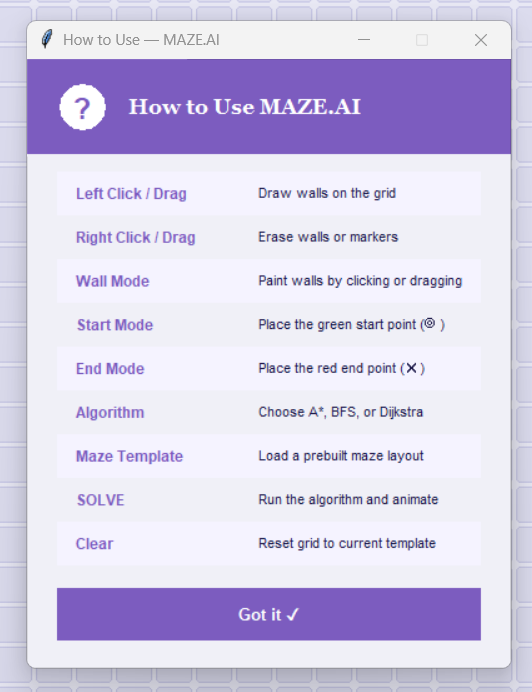
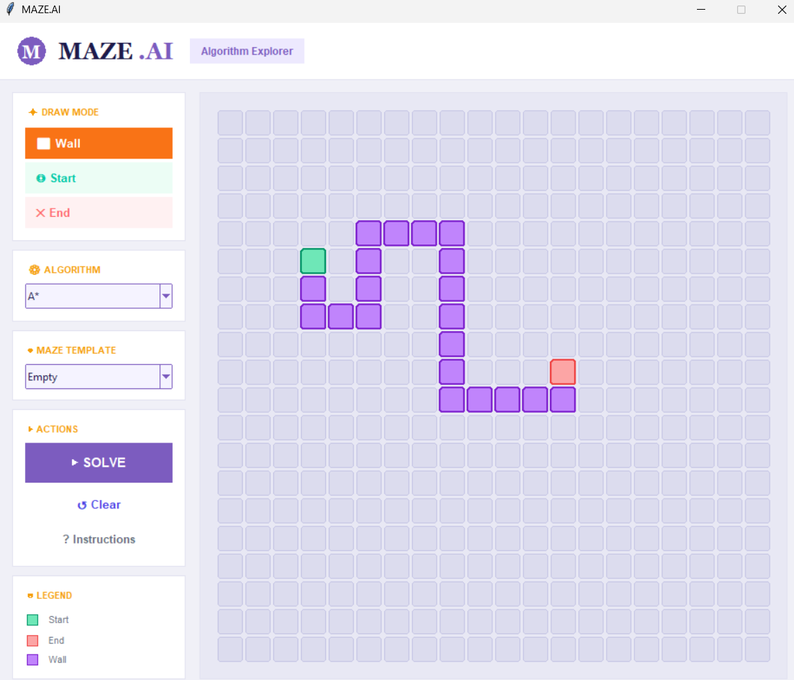
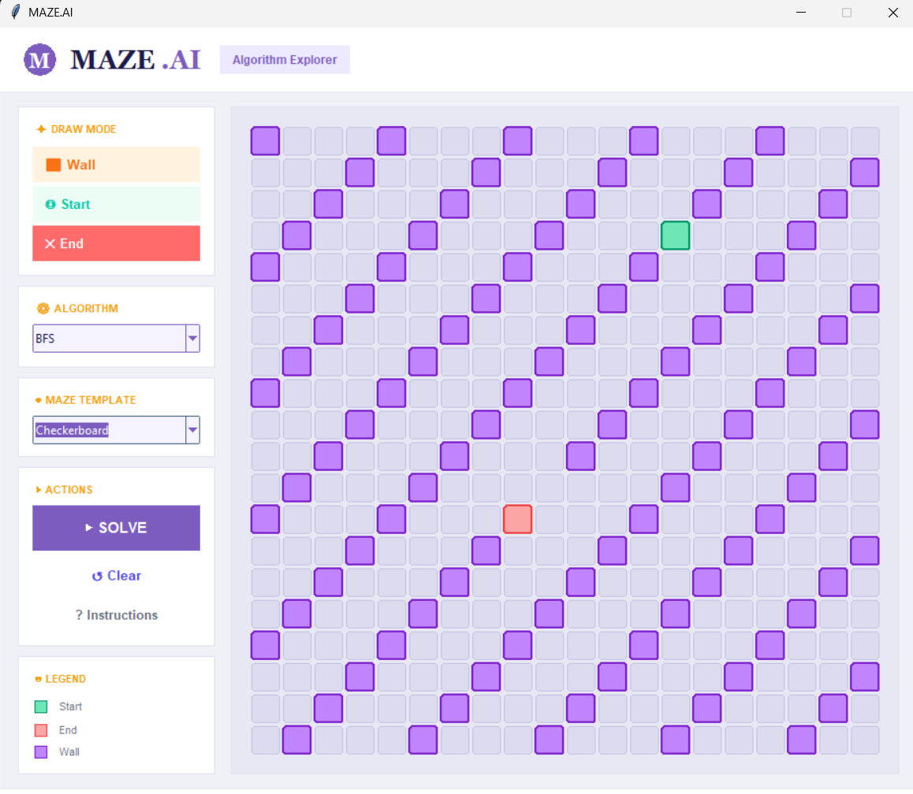
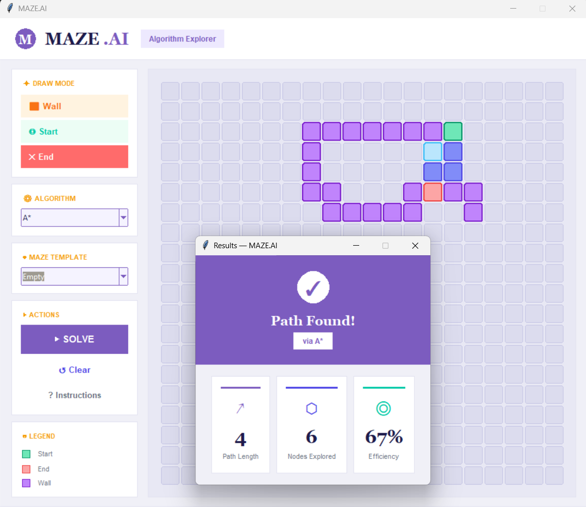
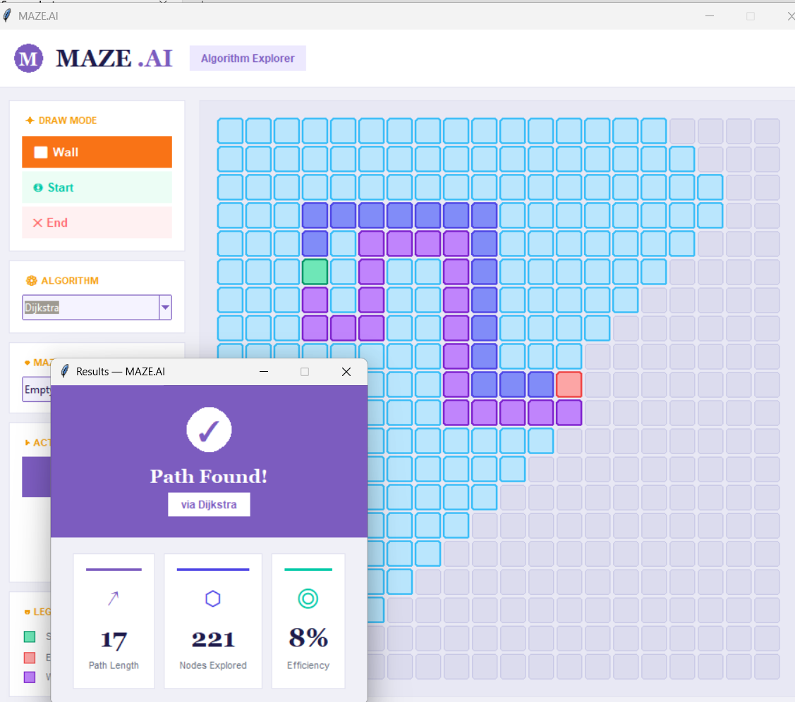

# AI Maze Solver

An interactive AI Maze Solver built with Python and Tkinter that visualizes and compares popular pathfinding algorithms. Users can design custom mazes, apply predefined maze templates, place start and goal nodes, and observe how different search algorithms explore the environment and find optimal paths.

## Features

* Interactive Tkinter GUI
* Custom Maze Creation
* Start and Goal Node Placement
* Wall Drawing and Editing
* Multiple Predefined Maze Templates
* Real-Time Search Visualization
* Path Reconstruction Display
* Algorithm Comparison

## Implemented Algorithms

### A* Search

* Uses Manhattan Distance Heuristic
* Optimal Pathfinding
* Efficient Search Performance

### Breadth-First Search (BFS)

* Uninformed Search Algorithm
* Guarantees Shortest Path in Uniform-Cost Grids

### Dijkstra's Algorithm

* Uniform Cost Search
* Finds Optimal Paths Without Heuristics

## Maze Templates

* Empty Grid
* Checkerboard Pattern
* Spiral Maze
* Vertical Bars
* The Box

## Technologies Used

* Python
* Tkinter
* Heapq (Priority Queue)
* Collections (Deque)
* Data Structures & Algorithms

## Learning Outcomes

* Artificial Intelligence Search Techniques
* Pathfinding Algorithms
* Heuristic Search
* GUI Development with Tkinter
* Graph Traversal
* Algorithm Visualization

## Future Enhancements

* Greedy Best-First Search
* Depth-First Search (DFS)
* Bidirectional Search
* Weighted Mazes
* Performance Statistics
* Search Tree Visualization

## Screenshots

### Application Instructions

### Custom Maze Design

### Spiral Maze Template

### A* Search Visualization

### Breadth-First Search (BFS)

### Dijkstra's Algorithm

## Author

**Sulaifa**
